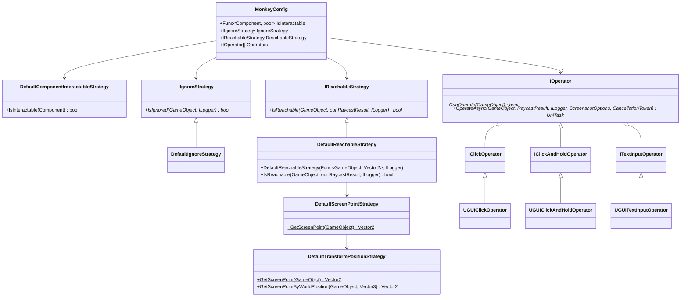

# Monkey Test Helper

[](https://github.com/nowsprinting/test-helper.monkey/actions/workflows/metacheck.yml)
[](https://github.com/nowsprinting/test-helper.monkey/actions/workflows/test.yml)
[](https://openupm.com/packages/com.nowsprinting.test-helper.monkey/)

Object-based [Unity UI](https://docs.unity3d.com/Packages/com.unity.ugui@latest) (uGUI) monkey testing and API for custom implementation.

This library can be used in runtime code because it does **NOT** depend on the [Unity Test Framework](https://docs.unity3d.com/Packages/com.unity.test-framework@latest).  
Required Unity 2019 LTS or later.


## Features

### Monkey testing

#### Monkey.Run

Runs monkey tests for uGUI (2D, 3D, and UI) elements.
`Monkey.Run` method operates on randomly selected objects. It does not use screen points.

Usage:

```csharp
using System;
using System.Threading.Tasks;
using NUnit.Framework;
using TestHelper.Monkey;

[TestFixture]
public class MyIntegrationTest
{
    [Test]
    public async Task MonkeyTesting()
    {
        var config = new MonkeyConfig
        {
            Lifetime = TimeSpan.FromMinutes(2),
            DelayMillis = 200,
            SecondsToErrorForNoInteractiveComponent = 5,
        };

        await Monkey.Run(config);
    }
}
```


#### MonkeyConfig

Configurations in `MonkeyConfig`:

- **Lifetime**: Running time
- **DelayMillis**: Delay time between operations
- **SecondsToErrorForNoInteractiveComponent**: Seconds after which a `TimeoutException` is thrown if no interactive component is found; default is 5 seconds
- **BufferLengthForDetectLooping**: An `InfiniteLoopException` is thrown if a repeating operation is detected within the specified buffer length; default length is 10
- **Random**: Pseudo-random number generator
- **Logger**: Logger
- **Verbose**: Output verbose log if true
- **Gizmos**: Show Gizmos on `GameView` during running monkey test if true
- **Screenshots**: Take screenshots during running the monkey test if set a `ScreenshotOptions` instance.
    - **Directory**: Directory to save screenshots. If omitted, the directory specified by command line argument "-testHelperScreenshotDirectory" is used. If the command line argument is also omitted, `Application.persistentDataPath` + "/TestHelper/Screenshots/" is used.
    - **FilenameStrategy**: Strategy for file paths of screenshot images. Default is test case name and four digit sequential number.
    - **SuperSize**: The factor to increase resolution with. Default is 1.
    - **StereoCaptureMode**: The eye texture to capture when stereo rendering is enabled. Default is `LeftEye`.
- **IsInteractable**: Function returns whether the `Component` is interactable or not. The default implementation returns true if the component is a uGUI compatible component and its `interactable` property is true.
- **IgnoreStrategy**: Strategy to examine whether `GameObject` should be ignored. The default implementation returns true if the `GameObject` has `IgnoreAnnotation` attached.
- **ReachableStrategy**: Strategy to examine whether `GameObject` is reachable from the user. The default implementation returns true if it can raycast from `Camera.main` to the pivot position.
- **Operators**: A collection of `IOperator` that the monkey invokes. The default is `UGUIClickOperator`, `UGUIClickAndHoldOperator`, `UguiDoubleClickOperator`, `UguiScrollWheelOperator`, and `UGUITextInputOperator`. There is support for standard uGUI components.

Class diagram for default strategies:




#### Annotations for Monkey's behavior

You can control the Monkey's behavior by attaching the annotation components to the `GameObject`.
Use the `TestHelper.Monkey.Annotations` assembly by adding it to the Assembly Definition References.
Please note that this will be included in the release build due to the way it works.

> [!NOTE]  
> Even if the annotations assembly is removed from the release build, the link to the annotation component will remain Scenes and Prefabs in the asset bundle built.
> Therefore, a warning log will be output during instantiate.
> To avoid this, annotations assembly are included in release builds.

##### IgnoreAnnotation

Monkey will not operate objects with `IgnoreAnnotation` attached.

##### InputFieldAnnotation

Specify the character kind and length input into `InputField` with `InputFieldAnnotation`.

##### ScreenOffsetAnnotation

Specify the screen position offset where Monkey operators operate.
Respects `CanvasScaler` but does not calculate the aspect ratio.

##### ScreenPositionAnnotation

Specify the screen position where Monkey operators operate.
Respects `CanvasScaler` but does not calculate the aspect ratio.

##### WorldOffsetAnnotation

Specify the world position offset where Monkey operators operate.

##### WorldPositionAnnotation

Specify the world position where Monkey operators operate.


### Find and operate GameObject

`GameObjectFinder` is a class that finds `GameObject` by name, path (can specify [glob](https://en.wikipedia.org/wiki/Glob_(programming)) pattern), or custom matcher.

Constructor arguments:

- **timeoutSeconds**: Seconds to wait until `GameObject` appears. The default is 1 second.
- **reachableStrategy**: Strategy to examine whether `GameObject` is reachable from the user. The default implementation returns true if it can raycast from `Camera.main` to the pivot position.
- **isInteractable**: Function returns whether the `Component` is interactable or not. The default implementation returns true if the component is a uGUI compatible component and its `interactable` property is true.


#### Find GameObject by name

Find a `GameObject` by name; if not found, poll until a timeout.
If the timeout, a `TimeoutException` is thrown.

Arguments:

- **name**: Find `GameObject` name
- **reachable**: Find only reachable object. Default is true
- **interactable**: Find only interactable object. Default is false

Usage:

```csharp
using NUnit.Framework;
using TestHelper.Monkey;

[TestFixture]
public class MyIntegrationTest
{
    [Test]
    public async Task MyTestMethod()
    {
        var finder = new GameObjectFinder();
        var result = await finder.FindByNameAsync("ConfirmDialog", reachable: true, interactable: false);
        var dialog = result.GameObject;
    }
}
```


#### Find GameObject by path

Find a `GameObject` by path; if not found, poll until a timeout.
If the timeout, a `TimeoutException` is thrown.

Arguments:

- **path**: Find `GameObject` hierarchy path separated by `/`. Can specify [glob](https://en.wikipedia.org/wiki/Glob_(programming)) pattern
- **reachable**: Find only reachable object. Default is true
- **interactable**: Find only interactable object. Default is false

Usage:

```csharp
using NUnit.Framework;
using TestHelper.Monkey;

[TestFixture]
public class MyIntegrationTest
{
    [Test]
    public async Task MyTestMethod()
    {
        var finder = new GameObjectFinder(5d); // 5 seconds timeout
        var result = await finder.FindByPathAsync("/**/Confirm/**/Cancel", reachable: true, interactable: true);
        var cancelButton = result.GameObject;
    }
}
```


#### Find GameObject by matcher

Find a `GameObject` by custom `IGameObjectMatcher`; if not found, poll until a timeout.
If the timeout, a `TimeoutException` is thrown.

Arguments:

- **matcher**: Custom `IGameObjectMatcher` implementation
- **reachable**: Find only reachable object. Default is true
- **interactable**: Find only interactable object. Default is false

Built-in matchers:

- `ButtonMatcher`: Matches `UnityEngine.UI.Button` components by `name`, `path`, `text`, or `texture`
- `ToggleMatcher`: Matches `UnityEngine.UI.Toggle` components by `name`, `path`, or `text`

Usage:

```csharp
using NUnit.Framework;
using TestHelper.Monkey;
using TestHelper.Monkey.GameObjectMatchers;

[TestFixture]
public class MyIntegrationTest
{
    [Test]
    public async Task MyTestMethod()
    {
        var finder = new GameObjectFinder();
        var matcher = new ButtonMatcher(text: "Click Me");
        var result = await finder.FindByMatcherAsync(matcher, reachable: true, interactable: false);
        var button = result.GameObject;
    }
}
```


#### Find GameObject in pageable component

Find a `GameObject` in pageable (or scrollable) UI components (e.g., `ScrollRect`, Carousel, Paged dialog) using the paginator.
A paginator provides step-by-step navigation through pageable content, allowing users to find objects that are not currently visible in the viewport.

Arguments:

- **matcher**: Custom `IGameObjectMatcher` implementation
- **reachable**: Find only reachable object. Default is true
- **interactable**: Find only interactable object. Default is false
- **paginator**: `IPaginator` implementation for controlling pageable components

Built-in paginators:

- `UguiScrollRectPaginator`: For `ScrollRect`
- `UguiScrollbarPaginator`: For `Scrollbar`

Usage:

```csharp
using NUnit.Framework;
using TestHelper.Monkey;
using TestHelper.Monkey.GameObjectMatchers;
using TestHelper.Monkey.Paginators;

[TestFixture]
public class MyIntegrationTest
{
    [Test]
    public async Task FindButtonInScrollView()
    {
        var finder = new GameObjectFinder();
        var matcher = new NameMatcher("Button_10");

        var scrollView = GameObject.Find("Scroll View");
        var scrollRect = scrollView.GetComponent<ScrollRect>();
        var paginator = new UguiScrollRectPaginator(scrollRect);

        var result = await finder.FindByMatcherAsync(matcher, paginator: paginator);
        var button = result.GameObject;
    }
}
```


#### Operate GameObject

`SelectOperators` and `SelectOperators<T>` are extensions of `GameObject` that return available operators.
Operators implement the `IOperator` interface. It has an `OperateAsync` method that operates on the component.

Usage:

```csharp
using NUnit.Framework;
using TestHelper.Monkey;

[TestFixture]
public class MyIntegrationTest
{
    [Test]
    public async Task ClickStartButton()
    {
        var finder = new GameObjectFinder();
        var result = await finder.FindByNameAsync("StartButton", interactable: true);

        var clickOperator = new UGUIClickOperator();
        await clickOperator.OperateAsync(result.GameObject, result.RaycastResult);
    }
}
```


### Find interactable components on the scene

`InteractableComponentsFinder` is a class that collects interactable components on the scene.

Constructor arguments:

- **isInteractable**: Function returns whether the `Component` is interactable or not. The default implementation returns true if the component is a uGUI compatible component and its `interactable` property is true.
- **operators**: A collection of `IOperator` used in the `FindInteractableComponentsAndOperators` method. The default is empty.

Usage:

```csharp
using System.Linq;
using NUnit.Framework;
using TestHelper.Monkey;

[TestFixture]
public class MyIntegrationTest
{
    [Test]
    public void MyTestMethod()
    {
        var finder = new InteractableComponentsFinder();
        var components = finder.FindInteractableComponents();
    }
}
```


### Editor Extensions

#### Copy Hierarchy Path to Clipboard

Select any `GameObject` in the Hierarchy window and right-click to open the context menu, then select **Copy to Clipboard > Hierarchy Path**.

#### Copy Instance ID to Clipboard

Select any `GameObject` in the Hierarchy window and right-click to open the context menu, then select **Copy to Clipboard > Instance ID**.


## Customization

### Functions for the strategy pattern

If your game title uses a custom UI framework that is not uGUI compatible and/or requires special operating, you can customize the monkey's behavior using the following:


#### IsInteractable

Returns whether the `Component` is interactable or not.
`DefaultComponentInteractableStrategy.IsInteractable()` returns true if the component is a uGUI compatible component and its `interactable` property is true.

You should replace this when you want to control special components that comprise your game title.


#### IgnoreStrategy

`IsIgnored()` method returns whether the `GameObject` is ignored or not.
`DefaultIgnoreStrategy.IsIgnored()` returns true if the `GameObject` has `IgnoreAnnotation` attached.

You should replace this when you want to ignore specific objects (e.g., by name and/or path) in your game title.


#### ReachableStrategy

`IsReachable()` method returns whether the `GameObject` is reachable from the user or not.
`DefaultReachableStrategy.IsReachable()` returns true if it can raycast from `Camera.main` to the pivot position.

You should replace this when you want to customize the raycast point (e.g., randomize position, specify camera).


#### Operators

Operators are a collection of `IOperator` that the monkey invokes.

You should replace this when you want to operate special components that comprise your game title (e.g., custom UI component, special click position).

A sub-interface of the `IOperator` (e.g., `IClickOperator`) must be implemented to represent the type of operator.
An operator must implement the `CanOperate` method to determine whether an operation such as click is possible and the `OperateAsync` method to execute the operation.

> [!IMPORTANT]  
> Until test-helper.monkey v0.14.0, it took screenshots and output logs in the caller. However, this has been changed to `OperateAsync` responsible.


## Troubleshooting

### Monkey

#### Thrown TimeoutException

If thrown `TimeoutException` with the following message:

```
Interactive component not found in 5 seconds
```

This indicates that no `GameObject` with an interactable component appeared in the scene within specified seconds.
`GameObject` determined to be Ignored will be excluded, even if they are interactable.
`GameObject` that are not reachable by the user are excluded, even if they are interactable.

More details can be output using the verbose option (`MonkeyConfig.Verbose`).

The waiting seconds can be specified in the `MonkeyConfig.SecondsToErrorForNoInteractiveComponent`.
If you want to disable this feature, specify `0`.


#### Thrown InfiniteLoopException

If thrown `InfiniteLoopException` with the following message:

```
Found loop in the operation sequence: [44030, 43938, 44010, 44030, 43938, 44010, 44030, 43938, 44010, 44030]
```

This indicates that a repeating operation is detected within the specified buffer length.
The pattern `[44030, 43938, 44010]` is looped in the above message.
Numbers are the instance ID of the operated `GameObject`.

The detectable repeating pattern max length is half the buffer length.
The buffer length can be specified in the `MonkeyConfig.BufferLengthForDetectLooping`.
If you want to disable this feature, specify `0`.


#### Operation log message

```
UGUIClickOperator operates to StartButton(-12345), screenshot=UGUIMonkeyAgent01_0001.png
```

This log message is output just before the operator `UGUIClickOperator` operates on the `GameObject` named `StartButton`.
"UGUIMonkeyAgent01_0001.png" is the screenshot file name taken just before the operation.

Screenshots are taken when the `MonkeyConfig.Screenshots` is set.


#### Verbose log messages

You can output details logs when the `MonkeyConfig.Verbose` is true.

##### Lottery entries

```
Lottery entries: [
  StartButton(30502):Button:UGUIClickOperator,
  StartButton(30502):Button:UGUIClickAndHoldOperator,
  MenuButton(30668):Button:UGUIClickOperator,
  MenuButton(30668):Button:UGUIClickAndHoldOperator
]
```

Each entry format is `GameObject` name (instance ID) : `Component` type : `Operator` type.

This log message shows the lottery entries that the monkey can operate.
Entries are made by the `IsInteractable` and `Operator.CanOperate` method.
`IsIgnore` and `IsReachable` are not used at this time.

If there are zero entries, the following message is output:

```
No lottery entries.
```

##### Ignored GameObject

If the lotteries `GameObject` is ignored, the following message will be output and lottery again.

```
Ignored QuitButton(30388).
```

##### Not reachable GameObject

If the lotteries `GameObject` is not reachable by the user, the following messages will be output and lottery again.

```
Not reachable to CloseButton(-2278), position=(515,-32). Raycast is not hit.
```

Or

```
Not reachable to BehindButton(-2324), position=(320,240). Raycast hit other objects: [BlockScreen, FrontButton]
```

The former output is when the object is off-screen, and the latter is when other objects hide the pivot position.
The position to send the raycast can be arranged using annotation components such as `ScreenOffsetAnnotation`.

##### No GameObjects that are operable

If all lotteries `GameObject` are not operable, the following message is displayed.
If this condition persists, a `TimeoutException` will be thrown.

```
Lottery entries are empty or all of not reachable.
```


### GameObjectFinder

#### Thrown TimeoutException

##### Not found

If no `GameObject` is found with the specified name, path, or matcher, throw `TimeoutException` with the following message:

```
GameObject (NameMatcher: Target) is not found.
```

Or for path:

```
GameObject (PathMatcher: Path/To/Target) is not found.
```

##### Not reachable

If `GameObject` is found with the specified name, path, or matcher but not reachable, throw `TimeoutException` with the following message:

```
GameObject (NameMatcher: Target) is found, but not reachable.
```

If you need detailed logs, pass an `ILogger` instance to the constructor of `GameObjectFinder`.

##### Not interactable

If `GameObject` is found with the specified name, path, or matcher but not interactable, throw `TimeoutException` with the following message:

```
GameObject (NameMatcher: Target) is found, but not interactable.
```

#### Thrown MultipleGameObjectsMatchingException

If multiple `GameObjects` matching the condition are found, throw `MultipleGameObjectsMatchingException` with the following message:

```
Multiple GameObjects matching the condition (NameMatcher: Target) were found.
```


## Run on player build

The "Define Constraints" is set to `UNITY_INCLUDE_TESTS || COM_NOWSPRINTING_TEST_HELPER_ENABLE` in this package's assembly definition files, so it is generally excluded from player builds.

To use the feature in player builds, add `COM_NOWSPRINTING_TEST_HELPER_ENABLE` to the scripting symbols at build time.

> [!TIP]  
> How to set custom scripting symbols, see below:  
> [Manual: Custom scripting symbols](https://docs.unity3d.com/Manual/custom-scripting-symbols.html)


## Installation

You can choose from two typical installation methods.

### Install via Package Manager window

1. Open the **Package Manager** tab in Project Settings window (**Editor > Project Settings**)
2. Click **+** button under the **Scoped Registries** and enter the following settings (figure 1.):
   1. **Name:** `package.openupm.com`
   2. **URL:** `https://package.openupm.com`
   3. **Scope(s):** `com.nowsprinting` and `com.cysharp`
3. Open the Package Manager window (**Window > Package Manager**) and select **My Registries** in registries drop-down list (figure 2.)
4. Click **Install** button on the `com.nowsprinting.test-helper.monkey` package

> [!NOTE]  
> Do not forget to add `com.cysharp` into scopes. These are used within this package.

**Figure 1.** Package Manager tab in Project Settings window.


**Figure 2.** Select registries drop-down list in Package Manager window.


### Install via OpenUPM-CLI

If you installed [openupm-cli](https://github.com/openupm/openupm-cli), run the command below:

```bash
openupm add com.nowsprinting.test-helper.monkey
```


### Add assembly reference

1. Open your test assembly definition file (.asmdef) in **Inspector** window
2. Add **TestHelper.Monkey** into **Assembly Definition References**


## License

MIT License


## How to contribute

Open an issue or create a pull request.

Be grateful if you could label the PR as `enhancement`, `bug`, `chore`, and `documentation`.
See [PR Labeler settings](.github/pr-labeler.yml) for automatically labeling from the branch name.


## How to development

### Clone repo as a embedded package

Add this repository as a submodule to the Packages/ directory in your project.

```bash
git submodule add git@github.com:nowsprinting/test-helper.monkey.git Packages/com.nowsprinting.test-helper.monkey
```

> [!WARNING]  
> Required installation packages for running tests (when embedded package or adding to the `testables` in manifest.json), as follows:
> - [Unity Test Framework](https://docs.unity3d.com/Packages/com.unity.test-framework@latest) package v1.3.4 or later
> - [TextMesh Pro](https://docs.unity3d.com/Packages/com.unity.textmeshpro@latest) package or [Unity UI](https://docs.unity3d.com/Packages/com.unity.ugui@latest) package v2.0.0 or later


### Run tests

Generate a temporary project and run tests on each Unity version from the command line.

```bash
make create_project
UNITY_VERSION=2019.4.40f1 make -k test
```

> [!WARNING]  
> You must select "Input Manager (Old)" or "Both" in the **Project Settings > Player > Active Input Handling** for running tests.


### Release workflow

The release process is as follows:

1. Run **Actions > Create release pull request > Run workflow**
2. Merge created pull request

Then, will do the release process automatically by [Release](.github/workflows/release.yml) workflow.
After tagging, [OpenUPM](https://openupm.com/) retrieves the tag and updates it.

> [!CAUTION]  
> Do **NOT** manually operation the following operations:
> - Create a release tag
> - Publish draft releases

> [!CAUTION]  
> You must modify the package name to publish a forked package.

> [!TIP]  
> If you want to specify the version number to be released, change the version number of the draft release before running the "Create release pull request" workflow.
